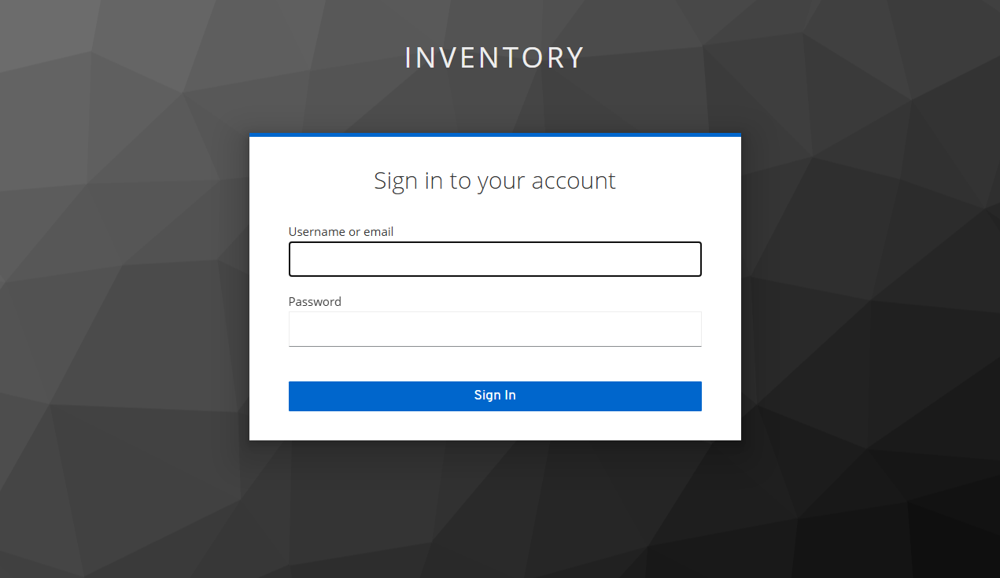
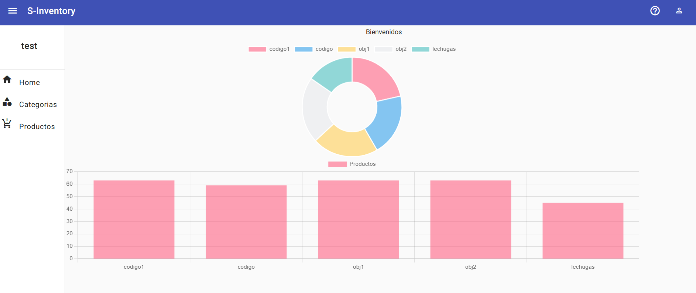
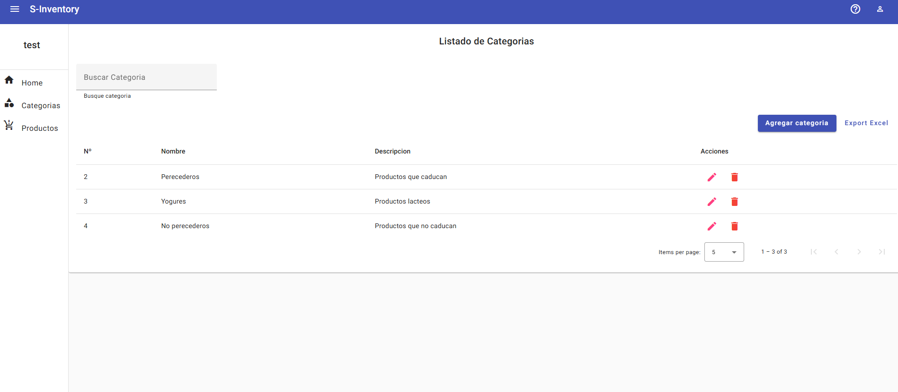
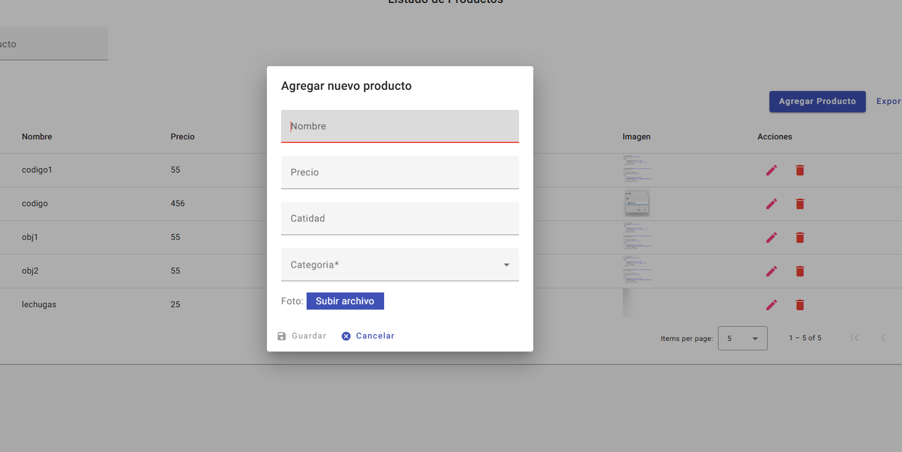

# 🧠 Sistema de Inventario Fullstack

Aplicación web fullstack desarrollada con **Spring Boot 3** y **Angular 16**, que permite gestionar inventario, usuarios y productos. Este proyecto forma parte de mi formación como **Desarrollador Fullstack** y ha sido desarrollado aplicando buenas prácticas y metodologías ágiles.

---

## 📑 Tabla de Contenido

- [📌 Descripción del Proyecto](#-descripción-del-proyecto)
- [🚀 Funcionalidades](#-funcionalidades)
- [🛠️ Tecnologías Utilizadas](#️-tecnologías-utilizadas)
- [🖥️ Capturas de Pantalla](#-capturas-de-pantalla)
- [📁 Repositorios del Proyecto](#-repositorios-del-proyecto)
- [✅ Aprendizajes y Experiencia](#-aprendizajes-y-experiencia)

---

## 📌 Descripción del Proyecto

Este sistema permite realizar la gestión completa de productos, movimientos de stock, usuarios y reportes. Se ha implementado autenticación y autorización mediante **Keycloak**, y el frontend y backend están completamente desacoplados y comunicados vía **API REST**. Todo el proyecto fue desarrollado siguiendo la metodología **Kanban**, utilizando herramientas como **Trello**, **GitHub** y **Confluence**.

---

## 🚀 Funcionalidades

### 👤 Usuario:
- Login con Keycloak (JWT)
- Visualización de productos
- Exportación de reportes en Excel

### 🛠️ Administrador:
- Gestión de productos y categorías
- Registro de entradas/salidas de stock
- Dashboard con estadísticas (Chart.js)
- Gestión de usuarios y roles

---

## 🛠️ Tecnologías Utilizadas

### Backend:
- Java 17
- Spring Boot 3
- MySQL
- Keycloak (OAuth2, JWT)
- Docker
- JUnit y Mockito
- GCP (Google Cloud Platform)

### Frontend:
- Angular 16
- Angular Material
- TypeScript
- Chart.js
- HTML & CSS

### DevOps y Gestión:
- Trello + Kanban
- Git + GitHub + Gitflow
- Confluence

---

## 🖥️ Capturas de Pantalla

- 
- 
- 
- 

---

## 📁 Repositorios del Proyecto

  

---

## ✅ Aprendizajes y Experiencia

- Desarrollo completo de una aplicación desacoplada (Frontend + Backend)
- Autenticación y autorización con Keycloak y JWT
- Creación de API RESTful con Spring Boot
- Seguridad, pruebas y buenas prácticas de desarrollo
- Uso de Docker para contenerización de servicios
- Despliegue en Google Cloud Platform
- Organización del proyecto con metodología ágil (Kanban)
